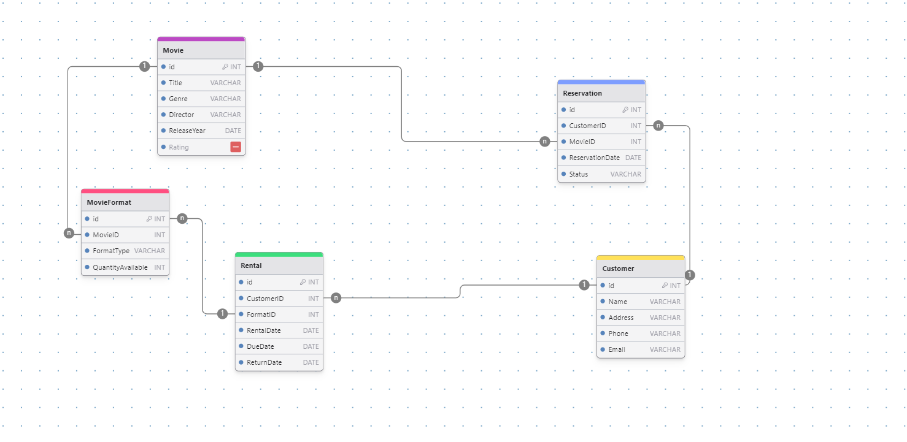

# RentalFlix - Movie Rental Service :movie_camera: 
## Overview

**RentalFlix** is a web-based API for a movie rental service designed to manage movie inventory, customer information, and rental records efficiently. The system aims to replace an outdated tracking system with a modern digital solution, providing a seamless experience for both staff and customers.

## Entity-Relationship Diagram (ERD) design
